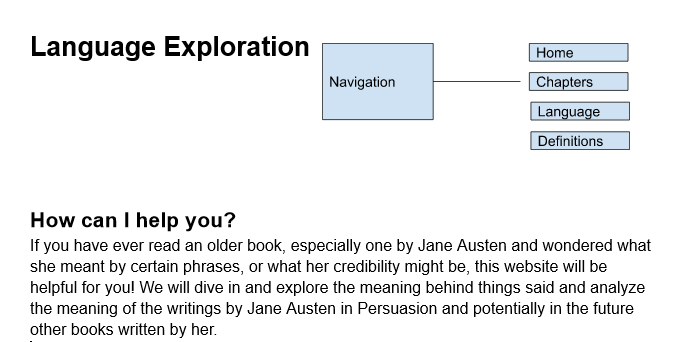

# My Project: Exploration of language in the 1700s

## Project Description
A project that helps us better understand Jane Austens Pathos, logos and ethos while writing the book persuasion.

## Data Source
- **Book 1:** [Persuasion](https://www.gutenberg.org/ebooks/105) by [Jane Austen](https://www.gutenberg.org/ebooks/author/68)

## Items of Interest
- Chapters
- Language
- Definitions

## Proposed Layout

